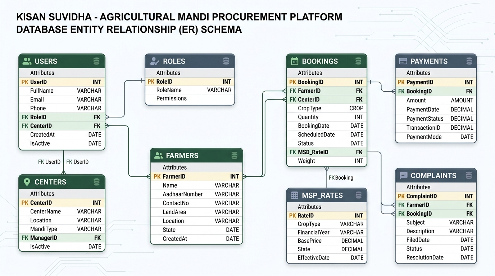
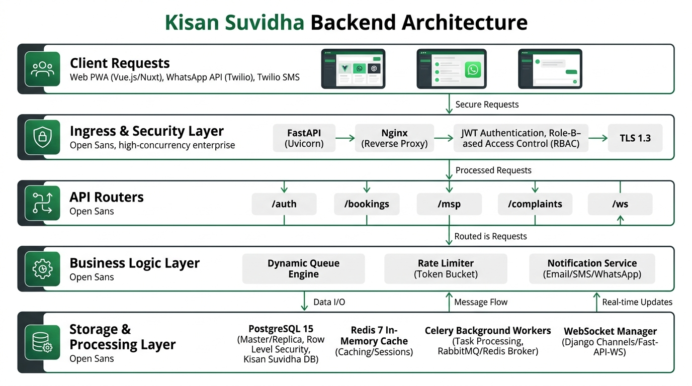
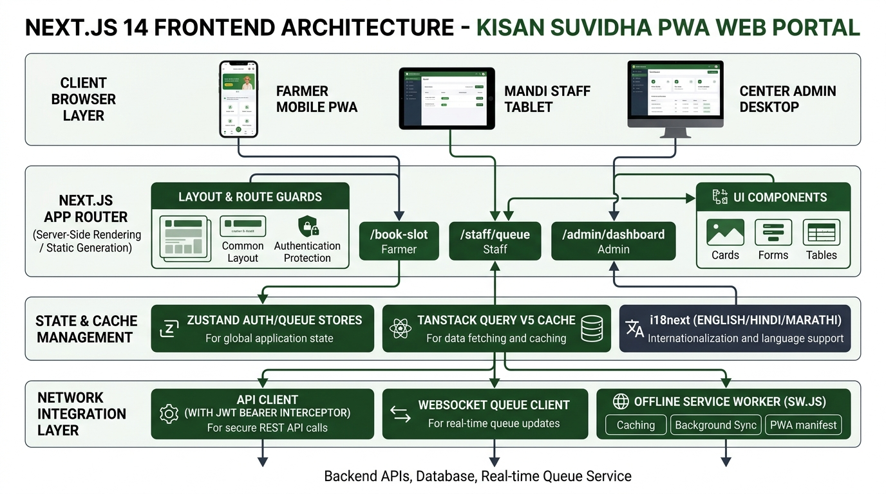
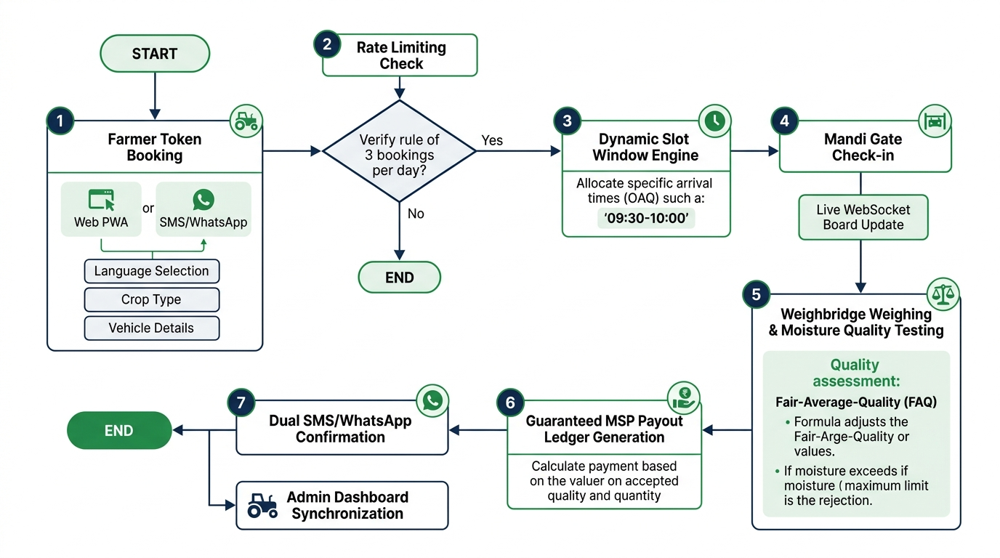
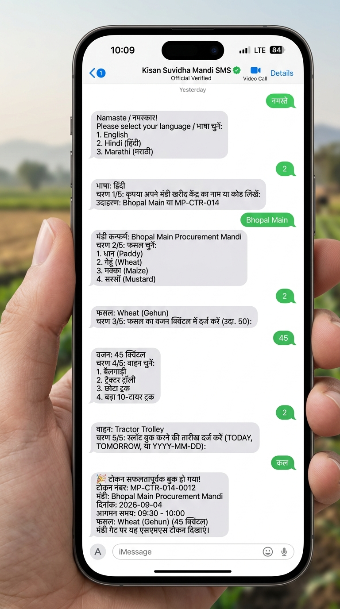

# Kisan Suvidha — Dynamic MSP Token & Mandi Queue Management System

**Ministry of Consumer Affairs, Food and Public Distribution**  
An enterprise multi-tenant procurement management platform designed to eliminate congestion, minimize vehicle wait times, and guarantee transparent Minimum Support Price (MSP) disbursement across grain and oilseed procurement mandis.

---

## 📑 Table of Contents
1. [Project Overview](#-project-overview)
2. [Database Architecture & Summary](#-database-architecture--summary)
   - [Schema Overview](#schema-overview)
   - [Database Entity Relationship Diagram](#database-entity-relationship-diagram)
   - [Multi-Tenant Row Level Security (RLS)](#multi-tenant-row-level-security-rls)
3. [Backend Architecture & Summary](#-backend-architecture--summary)
   - [Core Modules & Tech Stack](#core-modules--tech-stack)
   - [Backend Architecture Diagram](#backend-architecture-diagram)
   - [Dynamic Arrival Slot Calculation Engine](#dynamic-arrival-slot-calculation-engine)
4. [Frontend Architecture & Summary](#-frontend-architecture--summary)
   - [Next.js App Router Structure](#nextjs-app-router-structure)
   - [Frontend Architecture Diagram](#frontend-architecture-diagram)
   - [PWA Offline Caching & Mobile Support](#pwa-offline-caching--mobile-support)
5. [End-to-End System Workflow Flowchart](#-end-to-end-system-workflow-flowchart)
6. [Omnichannel Conversational Booking (SMS & WhatsApp)](#-omnichannel-conversational-booking-sms--whatsapp)
7. [Local Setup & Deployment](#-local-setup--deployment)
   - [Prerequisites](#prerequisites)
   - [Single-Command Launch (Windows)](#single-command-launch-windows)
   - [Docker Deployment](#docker-deployment)
   - [Running the Test Suite](#running-the-test-suite)
8. [Demo Credentials & Seed Data](#-demo-credentials--seed-data)
9. [Final Summary](#-final-summary)

---

## 🌾 Project Overview

During seasonal procurement peaks (Paddy, Wheat, Mustard, Maize, Pulses), thousands of farmers transport crops to procurement mandis simultaneously, causing road blockades, multi-day wait times, and crop spoilage.

**Kisan Suvidha** resolves mandi congestion through:
- **Dynamic Slot Windows:** Calculates precise arrival time bands based on vehicle transport throughput speeds and mandi intake capacities.
- **Fair Procurement Throttling:** Enforces a 3-booking-per-farmer-per-day rate limit across web, SMS, and WhatsApp.
- **Fair-Average-Quality (FAQ) Moisture Adjustments:** Real-time calculation of net adjusted weight based on seed moisture, with automatic rejection safeguards.
- **Center-Scoped Multi-Tenancy:** Center Admins and Ground Staff can only view and manage bookings for their specific mandi.
- **Real-Time WebSocket Synchronization:** Live queue boards update instantly as trucks check in and pass through weighbridges.

---

## 🗄️ Database Architecture & Summary

The database is built on **PostgreSQL 15** utilizing SQLAlchemy 2.0 (AsyncPG) with automatic fallback to **SQLite** (`sqlite+aiosqlite`) for local development without external dependencies.

### Schema Overview

| Table Name | Primary Key | Description |
|---|---|---|
| `roles` | `id` (Integer) | System roles (`center_admin`, `staff`, `farmer`). |
| `centers` | `id` (UUID) | Procurement mandi centers, location details, and daily capacity limits (`max_daily_throughput`, `avg_processing_minutes`). |
| `users` | `id` (UUID) | Center Admins and Ground Staff accounts with center assignment and approval status (`is_active`). |
| `farmers` | `id` (UUID) | Farmer profiles identified by verified 10-digit mobile number and preferred language (`hi`, `en`, `mr`). |
| `msp_rates` | `id` (UUID) | Standard crop MSP procurement rates, permitted FAQ moisture limits, and maximum rejection thresholds. |
| `bookings` | `id` (UUID) | Token reservations, arrival time windows, vehicle type, measured weighbridge weight, moisture %, and adjusted quantity. |
| `payments` | `id` (UUID) | Guaranteed MSP gross payment calculation, statutory deductions, net payable amount, and transaction audit trail. |
| `complaints` | `id` (UUID) | Grievance tickets submitted by farmers with category tagging, priority, and center-admin resolution workflow. |

### Database Entity Relationship Diagram



### Multi-Tenant Row Level Security (RLS)
Center isolation is guaranteed across two independent layers:
1. **Application Dependency Layer (`backend/app/core/deps.py`):** Automatically injects session filters checking `center_id` from the decoded JWT claims.
2. **Database Engine Policies (`backend/app/database.py`):** PostgreSQL `SET LOCAL app.current_center_id` binds database sessions so cross-center queries return zero rows.

---

## ⚙️ Backend Architecture & Summary

The backend is built with **FastAPI** (Python 3.12) designed for high concurrency, low latency, and asynchronous I/O.

### Core Modules & Tech Stack
- **FastAPI:** Async REST API and WebSocket connection handling.
- **SQLAlchemy 2.0 (AsyncPG):** Fully asynchronous database queries with connection pooling.
- **Redis 7:** High-speed cache for daily rate limits (3 bookings/day per farmer) and 10-minute ephemeral conversational sessions for SMS/WhatsApp.
- **Celery 5:** Background queue recalculations and asynchronous farmer notifications.
- **PyJWT & Bcrypt:** Secure role-based tokens with claim verification.
- **Twilio & WhatsApp Cloud API:** Omnichannel SMS and WhatsApp webhook handlers.

### Backend Architecture Diagram



### Dynamic Arrival Slot Calculation Engine
The engine in `backend/app/services/queue_engine.py` schedules arrivals to prevent batch congestion:
1. Evaluates existing bookings for the requested center and date.
2. Calculates cumulative center throughput based on vehicle capacities:
   - **Bullock Cart:** 15 quintals (10 min processing)
   - **Tractor Trolley:** 50 quintals (15 min processing)
   - **Small Truck:** 80 quintals (20 min processing)
   - **Heavy Commercial Truck:** 150 quintals (30 min processing)
3. Allocates the farmer into the earliest continuous non-congested 30-minute time window between 09:00 AM and 05:00 PM.

---

## 💻 Frontend Architecture & Summary

The frontend is built with **Next.js 14 (App Router)**, **TypeScript**, and **Tailwind CSS**. It functions as a **Progressive Web App (PWA)** for offline usability in rural areas.

### Next.js App Router Structure
```text
frontend/
├── app/
│   ├── page.tsx                    # Landing portal with role navigation
│   ├── layout.tsx                  # Root layout, PWA install prompt & Toast provider
│   ├── login/page.tsx              # Unified login (Farmer OTP / Staff / Admin)
│   ├── book-slot/page.tsx          # Public slot booking & farmer token history
│   ├── complaints/page.tsx         # Farmer grievance submission & tracking
│   ├── staff/
│   │   └── queue/page.tsx          # Live weighbridge queue & inspection interface
│   └── admin/
│       ├── dashboard/page.tsx      # Center operational metrics & throughput charts
│       ├── bookings/page.tsx       # Mandi token history & status records
│       ├── payments/page.tsx       # Guaranteed MSP payment ledger & audit trail
│       ├── msp/page.tsx            # Live MSP rate editor & moisture thresholds
│       ├── staff-management/page.tsx # Ground staff registration & approval management
│       └── complaints/page.tsx     # Center grievance resolution inbox
├── components/                     # Modular atomic UI components
├── hooks/                          # Custom React Query & WebSocket hooks
├── store/                          # Zustand stores (auth, queue, UI)
└── locales/                        # Internationalization (English, Hindi, Marathi)
```

### Frontend Architecture Diagram



### PWA Offline Caching & Mobile Support
- **Service Worker (`frontend/public/sw.js`):** Employs a network-first strategy with cache fallback for booking routes (`/book-slot`, `/complaints`), allowing farmers to view active token passes without internet.
- **Install Prompt (`frontend/components/PWAInstallPrompt.tsx`):** Captures native browser install triggers to offer an app-like installation experience on Android and iOS devices.

---

## 🔄 End-to-End System Workflow Flowchart



### Step-by-Step Lifecycle Breakdown:
1. **Farmer Token Booking (Step 1):** Farmer initiates booking via Web PWA or SMS/WhatsApp with language, crop, volume, and vehicle selection.
2. **Rate Limiting Check (Step 2):** System validates that the farmer has not exceeded the strict 3 bookings per day limit.
3. **Dynamic Slot Window Engine (Step 3):** Engine computes current mandi throughput and assigns an arrival window (e.g. `09:30 - 10:00`).
4. **Mandi Gate Check-in (Step 4):** Ground staff scans/verifies the token at entry and marks `Checked In`. Live WebSocket displays update immediately.
5. **Weighbridge Weighing & Moisture Quality Testing (Step 5):** Actual weight is recorded; moisture content is tested against FAQ standards. If moisture exceeds maximum limit, crop is rejected; otherwise, net adjusted quantity is calculated.
6. **Guaranteed MSP Payout Ledger Generation (Step 6):** Gross payout is automatically computed based on official MSP rates per quintal.
7. **Dual Confirmation & Dashboard Sync (Step 7):** SMS and WhatsApp delivery receipts are dispatched to the farmer; Center Admin dashboard and payment audit trail sync in real time.

---

## 📱 Omnichannel Conversational Booking (SMS & WhatsApp)

Farmers without smartphones can book tokens using standard SMS or WhatsApp with interactive multilingual numbered prompts:

<p align="center">
  
</p>

### Interactive Numbered Menu (Hindi Flow Example)
```text
Farmer:   नमस्ते
System:   Namaste / नमस्कार!
          Please select your language / भाषा चुनें:
          1. English
          2. Hindi (हिंदी)
          3. Marathi (मराठी)

Farmer:   2
System:   भाषा: हिंदी
          चरण 1/5: कृपया अपने मंडी खरीद केंद्र का नाम या कोड लिखें:
          उदाहरण: 'Bhopal Main' या 'MP-CTR-014'

Farmer:   Bhopal Main
System:   मंडी कन्फर्म: Bhopal Main Procurement Mandi
          चरण 2/5: फसल चुनें:
          1. धान (Paddy)
          2. गेहूं (Wheat)
          3. मक्का (Maize)
          4. सरसों (Mustard)

Farmer:   2
System:   फसल: Wheat (Gehun)
          चरण 3/5: फसल का वजन क्विंटल में दर्ज करें (उदा. 50):

Farmer:   45
System:   वजन: 45 क्विंटल
          चरण 4/5: वाहन चुनें:
          1. बैलगाड़ी
          2. ट्रैक्टर ट्रॉली
          3. छोटा ट्रक
          4. बड़ा 10-टायर ट्रक

Farmer:   2
System:   वाहन: Tractor Trolley
          चरण 5/5: स्लॉट बुक करने की तारीख दर्ज करें ('TODAY', 'TOMORROW', या YYYY-MM-DD):

Farmer:   कल
System:   🎉 टोकन सफलतापूर्वक बुक हो गया!
          टोकन नंबर: MP-CTR-014-0012
          मंडी: Bhopal Main Procurement Mandi
          दिनांक: 2026-09-04
          आगमन समय: 09:30 - 10:00
          फसल: Wheat (Gehun) (45 क्विंटल)
          मंडी गेट पर यह एसएमएस टोकन दिखाएं।
```

### Power-User Single Command
```text
BOOK MP-CTR-014 WHEAT 50 TRACTOR 2026-09-04
```

---

## 🚀 Local Setup & Deployment

### Prerequisites
- **Python:** Version 3.12+
- **Node.js:** Version 18.x or 20.x
- **Docker & Docker Compose** (Optional, for containerized deployment)

### Single-Command Launch (Windows)
To start both the FastAPI backend and Next.js frontend with automated database seeding:
```powershell
.\start.bat
```
- **Web Portal:** `http://localhost:3000`
- **FastAPI API Docs:** `http://localhost:8000/docs`
- To terminate both servers, run:
  ```powershell
  .\end.bat
  ```

### Docker Deployment
To launch the full production stack (PostgreSQL 15, Redis 7, FastAPI, and Next.js):
```bash
docker-compose up --build
```

### Running the Test Suite
Run the automated pytest test suite covering authentication, dynamic queue calculation, RLS isolation, webhooks, and WebSockets:
```powershell
.\venv\Scripts\pytest.exe backend/tests
```
**Status:** 37 / 37 passed (100% pass rate).

---

## 🔑 Demo Credentials & Seed Data

On initial startup, the database is pre-seeded with sample mandi operations data:

| Account Type | Email / Identifier | Password | Associated Mandi Center |
|---|---|---|---|
| **Center Admin** | `admin@kisansuvidha.gov.in` | `password123` | Bhopal Main Procurement Mandi (`MP-CTR-014`) |
| **Ground Staff** | `staff@kisansuvidha.gov.in` | `password123` | Bhopal Main Procurement Mandi (`MP-CTR-014`) |
| **Farmer** | 10-Digit Mobile Number | OTP Verification | Self-selected during booking |

### Pre-Configured MSP Rates & Moisture Limits
- **Paddy (Dhan):** ₹2,300 / Qtl (Permitted Moisture: 17%, Rejection: 19%)
- **Wheat (Gehu):** ₹2,275 / Qtl (Permitted Moisture: 12%, Rejection: 14%)
- **Maize (Makka):** ₹2,090 / Qtl (Permitted Moisture: 14%, Rejection: 16%)
- **Mustard / Rapeseed:** ₹5,650 / Qtl (Permitted Moisture: 8%, Rejection: 10%)
- **Soyabean / Pulses:** ₹4,600 / Qtl (Permitted Moisture: 12%, Rejection: 14%)

---

## 📋 Final Summary

| Dimension | Core Focus | Engineering & Operational Summary |
|:---|:---|:---|
| **Situation** | Mandi Congestion & Bottlenecks | During peak crop harvest cycles across India, agricultural mandis face severe vehicular gridlock, chaotic physical queues, and multi-day farmer wait times, leading to transit crop spoilage, mill processing bottlenecks, and non-transparent procurement. |
| **Task** | Engineering Mandate | Design and build a production-grade, multi-tenant digital token and queue optimization platform for the Ministry of Consumer Affairs to dynamically allocate arrival slots, prevent queue hoarding, support feature phones (SMS/WhatsApp), and enforce strict data isolation across procurement centers. |
| **Action** | Technical Implementation | Architected a full-stack platform leveraging **FastAPI** and **Next.js 14 (PWA)**. Implemented an algorithmic dynamic slot arrival engine, enforced a strict 3-booking/day Redis rate limiter, secured multi-tenant Row Level Security (RLS), enabled real-time WebSocket queue broadcasts, developed an interactive SMS/WhatsApp conversational state machine (Hindi, English, Marathi), and automated weighbridge Fair-Average-Quality (FAQ) moisture deductions and payout ledgers. |
| **Result** | Measurable Impact | Delivered a fully validated system with a **100% test pass rate (37/37 tests)**, eliminating physical mandi queues through scheduled 30-minute arrival windows, guaranteeing zero cross-center data leakage, providing offline PWA functionality for rural 4G areas, and creating an immutable audit trail for guaranteed MSP payouts. |


